# 《等等看》Design Specification v1.0

| 項目 | 內容 |
|---|---|
| 文件狀態 | Phase 1 設計交付基準 |
| 文件修訂 | 1.3（2026-07-21 備份規格決策補完） |
| 平台 | iOS |
| 設計來源 | Design System v1.0、Component Library、High Fidelity UI v1.1 Final |
| 設計基準 | Apple Human Interface Guidelines、iPhone 單手操作、Dynamic Type |

## 1. Design Direction

《等等看》的 UI 是安靜、可信任的生活容器。使用者收藏內容時，畫面傳達「已經收好了」，不是催促下一個動作。

品牌關鍵字：

- 簡約。
- 溫暖。
- 留白。
- 安心。
- 生活感。

禁止方向：

- 可愛化。
- 科技感與炫技。
- 商務 Dashboard。
- 過度極簡而失去資訊層級。
- 仿真紙紋、手寫字體、多彩便條紙或可愛插畫。

## 2. Design Principles

1. 能不用 Icon 就不用 Icon。
2. 必須使用 Icon 時採自製 Outline 風格。
3. Icon 數量越少越好。
4. 每個元素必須有明確資訊或操作理由。
5. 以字級、字重、間距與留白建立層級。
6. 不使用複雜動畫。
7. 優先考慮 iPhone 單手操作。
8. 所有觸控區至少 44 × 44 pt。
9. 溫暖來自色溫、留白與自然文案，不靠裝飾。
10. 所有元件同時提供 Light／Dark Preview。

## 3. Design Tokens

### 3.1 Color — Brand

| Token | Light | Dark | Usage |
|---|---:|---:|---|
| `brand.primary` | `#9B4A36` | `#D88B73` | Primary Button、選取、重要互動 |
| `brand.primaryPressed` | `#813B2B` | `#E5A08B` | Pressed |
| `brand.soft` | `#F2E3DC` | `#4B3029` | 選取底色、低強度提示 |
| `brand.onPrimary` | `#FFFFFF` | `#241916` | 品牌色上的文字 |

品牌主色為低彩度陶土色，不以高彩度橘色、科技藍或紫色替代。

### 3.2 Color — Surface and Text

| Token | Light | Dark | Usage |
|---|---:|---:|---|
| `surface.canvas` | `#F8F6F1` | `#171614` | App 全域背景 |
| `surface.primary` | `#FFFFFF` | `#23211E` | Card、Sheet、Input |
| `surface.secondary` | `#F0EDE7` | `#2D2A26` | 次層區塊、Disabled 背景 |
| `surface.overlay` | `rgba(30,27,24,0.32)` | `rgba(0,0,0,0.56)` | Sheet／Modal 遮罩 |
| `text.primary` | `#282521` | `#F5F1EA` | 標題、正文 |
| `text.secondary` | `#6E6861` | `#BDB5AB` | Metadata、輔助內容 |
| `text.tertiary` | `#918A82` | `#918A82` | 弱資訊 |
| `border.subtle` | `#E3DED6` | `#3B3833` | 分隔線、Input Border |
| `icon.primary` | `#3C3833` | `#EAE4DC` | 必要 Outline Icon |
| `icon.secondary` | `#777069` | `#AAA29A` | 次要 Outline Icon |
| `placeholder` | `#DDD8D0` | `#393631` | 無圖片、Metadata Pending／Failed |

所有 Metadata Placeholder 必須使用 `placeholder`，不得在元件內寫死色碼。

### 3.3 Color — Semantic

| Token | Light | Dark | Usage |
|---|---:|---:|---|
| `semantic.success` | `#3F7255` | `#78B58C` | 本機儲存成功 |
| `semantic.successSoft` | `#E4EEE7` | `#243D2E` | 成功提示背景 |
| `semantic.warning` | `#946515` | `#D5A44C` | 可繼續但需注意 |
| `semantic.warningSoft` | `#F5EBD5` | `#473718` | 注意提示背景 |
| `semantic.error` | `#B33A3A` | `#EA7771` | 錯誤、刪除 |
| `semantic.errorSoft` | `#F6E1DF` | `#4B2523` | 錯誤提示背景 |

Rules：

- 一般文字對比至少 4.5:1，大字至少 3:1。
- 顏色不能是唯一狀態線索。
- `brand.primary` 不作大面積背景。
- 紅色只用於錯誤或破壞性動作。

## 4. Typography

使用 iOS 系統字體 SF Pro；繁體中文由系統提供相容字型。不嵌入品牌字體。

| Token | iOS Text Style | Base Size / Line Height | Weight | Usage |
|---|---|---:|---|---|
| `type.largeTitle` | Large Title | 34 / 41 pt | Bold | 必要頁面主標 |
| `type.title1` | Title 1 | 28 / 34 pt | Bold | Onboarding 主句 |
| `type.title2` | Title 2 | 22 / 28 pt | Semibold | 區塊標題、重要 Sheet |
| `type.title3` | Title 3 | 20 / 25 pt | Semibold | Card／Detail 標題 |
| `type.headline` | Headline | 17 / 22 pt | Semibold | Navigation、主要列 |
| `type.body` | Body | 17 / 24 pt | Regular | 主要內文、輸入文字 |
| `type.callout` | Callout | 16 / 21 pt | Regular | 輔助說明、Button 次文字 |
| `type.subheadline` | Subheadline | 15 / 20 pt | Regular | Metadata、列表摘要 |
| `type.footnote` | Footnote | 13 / 18 pt | Regular | 時間、來源、狀態 |
| `type.caption` | Caption 1 | 12 / 16 pt | Regular | 最小補充資訊 |

Typography Rules：

- 不以 8–9 px 作實際產品字級。
- 中文正文不使用 Light Weight。
- 主要內容支援 Dynamic Type。
- 使用者內容不可無提示截斷。
- 標題最多兩行；必要時截斷，但 VoiceOver 仍讀完整內容。
- 長文靠左，不使用全形置中。

## 5. Spacing

採 4 pt Grid。

| Token | Value | Usage |
|---|---:|---|
| `space.1` | 4 pt | 微小狀態間距 |
| `space.2` | 8 pt | 同一資訊群組 |
| `space.3` | 12 pt | Icon 與文字、緊密內容 |
| `space.4` | 16 pt | Card Padding、一般間距 |
| `space.5` | 20 pt | 頁面水平留白 |
| `space.6` | 24 pt | 區塊內大型間距 |
| `space.8` | 32 pt | 區塊間距 |
| `space.10` | 40 pt | Empty State |
| `space.12` | 48 pt | 大型段落分隔 |
| `space.16` | 64 pt | Onboarding／沉浸頁留白 |

預設頁面左右 20 pt；緊湊列表可用 16 pt。內容不得貼齊螢幕或 Home Indicator。

## 6. Radius

| Token | Value | Usage |
|---|---:|---|
| `radius.small` | 8 pt | 小型 Tag、縮圖 |
| `radius.medium` | 12 pt | Input、小 Card |
| `radius.large` | 16 pt | 主要 Card、提示面板 |
| `radius.xLarge` | 22 pt | 大型容器、Sheet |
| `radius.pill` | 999 pt | 短文字 Chip／Pill |

同一容器的內層圓角應小於外層；單頁以 12／16 pt 為主。

## 7. Shadow

| Token | Light | Dark | Usage |
|---|---|---|---|
| `shadow.none` | None | None | 一般列表、Card |
| `shadow.soft` | y 2, blur 10, `rgba(36,30,24,0.08)` | y 2, blur 12, `rgba(0,0,0,0.28)` | 提示、小型浮層 |
| `shadow.modal` | y 8, blur 28, `rgba(36,30,24,0.14)` | y 8, blur 30, `rgba(0,0,0,0.42)` | Sheet、Modal |

優先用 Surface 與 Border 表達層級；不使用多層陰影或發光。

## 8. Iconography

- 最終 Icon 為自製 Outline。
- Default Line Width 1.5 pt；Selected 可提高至 2 pt，不轉 Filled。
- Icon 只在沒有文字會降低理解時使用。
- Icon Button 具 44 × 44 pt 觸控區與 VoiceOver Label。
- 不依賴第三方品牌 Icon 風格。
- 不用 Emoji 作正式 Category Icon；Final UI 中示意符號不等於最終資產。

必要 Icon 範圍：

- Bottom Navigation 四個 Icon。
- Search。
- Back／Disclosure。
- Share。
- Delete。
- External Link。
- Sort／Filter。
- Close。
- Placeholder／Metadata 狀態。

## 9. Buttons

所有 Button 最小 44 × 44 pt；Primary 視覺高度建議 50 pt。

| Variant | Style | Usage |
|---|---|---|
| Primary | `brand.primary` 背景、`brand.onPrimary` 文字、12 pt Radius | 畫面唯一主要完成動作 |
| Secondary | `surface.primary`、1 pt Border | 重要次要動作 |
| Tertiary | 無容器、Brand Text | 導覽、低強度動作 |
| Destructive | Error Color | 刪除 |
| Icon Button | 44 pt Hit Area、Outline Icon | 只在 Icon 意義清楚時 |

States：Default、Pressed、Disabled、Loading。

- Loading 保留原寬，避免 Layout Shift。
- Disabled 仍需可辨識。
- Button Copy 使用明確動詞：「幫我記住」「匯出收藏」「每天提醒我」「換一批」。

## 10. Inputs

| Component | Specification |
|---|---|
| Single-line Field | Min Height 50 pt、Horizontal Padding 16 pt、Radius 12 pt |
| Search Field | Height 48 pt、必要 Search Outline Icon |
| Text Area | Min Height 112 pt、Padding 16 pt、可隨內容長高 |
| Selection Row | Min Height 52 pt、文字為主、右側 Disclosure |
| Time Picker | 使用 iOS 原生時間選擇 |

States：Default、Focused、Filled、Disabled、Error。

- 固定 Label 不可只依賴 Placeholder。
- Error 放在欄位下方，指出如何修正。
- Share Extension Tag Field 預設完全空白。

## 11. Cards

### 11.1 Base Content Card

- `surface.primary`。
- Radius 16 pt。
- Padding 16 pt。
- 無陰影或 subtle border。
- 整張 Card 可點；內部不塞多個互相競爭的操作。

### 11.2 Category Preview Card

- 收藏首頁主要入口。
- 左側：分類名稱、收藏數。
- 右側：2–4 張預覽圖。
- 圖片不足或失敗：使用 `placeholder`。
- 不加入首頁 Recent Carousel。

### 11.3 Collection Row/Card

- 圖片或 Placeholder。
- 標題或 URL 替代文字。
- 來源。
- 必要 Metadata。
- 整張可點，進 Bookmark Detail。

### 11.4 Pegboard Card

- 保留洞洞板背景與釘選視覺。
- 圖片、標題、來源、Category、Tag。
- Reason 存在才顯示 Sticky Note Content Region。
- 無 Reason 時不保留空白區、不顯示引導文。
- Card Height 隨文字與 Reason 增長。

### 11.5 Daily Recall Card

- 圖片、標題、來源說明。
- 可顯示「最近收藏」「久未開啟」「洞洞板」來源標籤。
- 點擊進 Bookmark Detail。
- 不顯示完成勾選或任務語意。

### 11.6 Status Card

- 使用 Semantic Soft 背景或 subtle border。
- 文案短，說明資料是否保留與可採取動作。
- 只用於需要持續顯示的狀態。

### 11.7 Backup Status Card

- 顯示資料儲存位置說明、收藏總筆數與最近一次備份日期。
- 未曾成功備份時顯示「尚未備份」，不得使用警告紅色或焦慮文案催促。
- 「匯出備份」與「匯入備份」使用分開的文字動作，不以模糊的「同步」按鈕呈現。
- 匯入的破壞性確認使用系統 Alert／Confirmation Dialog，不在一般卡片中預設標紅整區。
- Phase 1 備份固定為不含圖片二進位檔的單一 JSON；格式本身不增加 ZIP／package 選項或額外圖片進度 UI。
- 匯入錯誤需區分超過 50 MB、checksum 不符、版本過新與內容不完整；版本過新時提供「請更新 App」指引。

## 12. Chips

### 12.1 Category Chip

- 單一 Chip。
- 使用 `brand.soft` 背景與 `brand.primary` 文字。
- 必須搭配「分類」標題。

### 12.2 Tag Chip

- 可為零個或多個。
- 使用次要 Surface／Border，視覺強度低於 Category Chip。
- 必須搭配「標籤」標題。

Category 與 Tag 即使同名，仍以標題、元件層級與樣式辨識。

## 13. Sticky Note

### 13.1 Home Sticky Note

- 固定在收藏首頁頂部。
- 全 App 一張。
- 暖白 Surface 與留白形成紙張感。
- 不使用紙紋、膠帶、折角、手寫字或多彩底色。
- 點擊原位編輯，自動儲存。

### 13.2 Bookmark Reason Note

- 只在 Reason 有內容時顯示完整便利貼區。
- 點擊直接編輯。
- 無內容時不顯示大型空白便利貼，也不強迫輸入。

## 14. Bottom Navigation

固定順序：

1. 收藏。
2. 洞洞板。
3. 搜尋。
4. 設定。

Rules：

- 使用 iOS 原生 Tab Bar 與 Safe Area。
- 不做浮動膠囊或第五個中央按鈕。
- Selected：`brand.primary` 加 2 pt Outline。
- Unselected：`text.secondary` 加 1.5 pt Outline。
- 不使用 Badge 或動態提示。

## 15. Empty States

Structure：Short Title → One-line Explanation → Optional Single Action。

| Screen | Title | Explanation | Action |
|---|---|---|---|
| Home | 還沒有收藏任何內容。 | 看到喜歡的內容，從分享選單交給《等等看》。 | 看看怎麼收藏 |
| Category | 這個分類還是空的。 | 下次收藏時選擇這個分類，就會出現在這裡。 | None |
| Pegboard | 洞洞板還是空的。 | 可以把特別想留下來的收藏釘在這裡。 | None |
| Search | 沒有找到符合的內容。 | None | 清除搜尋 |
| Daily Recall | 今天還沒有可回顧的收藏。 | 收藏一些內容後，再回來看看。 | 返回 |

不使用大型插畫、成就、進度或催促文案。

## 16. Loading and Placeholder

- Metadata Pending 使用與實際 Card 相符的低對比 Skeleton。
- Placeholder 全部使用 `placeholder` Token。
- 有 URL 但無 Title：URL／domain 填補文字位置。
- 無 Image：固定比例 Placeholder，不保留不合理空白。
- 低於約 300 ms 不立即顯示 Loading。
- Button Loading 使用原生 Progress View，保留按鈕尺寸。
- Reduce Motion 下停止流光。

## 17. Error States

| Level | Presentation | Example |
|---|---|---|
| Inline | Input 下方 | 指出如何修正 |
| Recoverable | Banner／Card | Metadata 暫時無法取得，網址已保留 |
| Blocking | Alert | 目前無法開啟這個連結 |

- Error 說明發生什麼、資料是否安全、下一步。
- 不顯示技術代碼。
- 本機內容不得因 Metadata 錯誤消失。

## 18. Animation and Haptics

- 使用 iOS 原生 Navigation／Sheet 動畫。
- 不使用視差、彈跳、長時間成功動畫或裝飾性轉場。
- Skeleton 為低速；Reduce Motion 時停止。
- Haptic 只用於收藏完成、選擇完成或錯誤等明確狀態。
- 不為每次點擊震動。

## 19. Dark Mode

- 跟隨 iPhone 系統。
- 不提供 App 內切換。
- 所有 Component 與 24 個畫面需提供 Light／Dark 驗收。
- Dark Mode 以深暖黑與深棕 Surface 保留溫度，不使用純黑大面積替代全部 Surface。
- Shadow、Border、Placeholder 與文字對比使用 Dark Token。

## 20. Dynamic Type

- 所有主要內容使用 iOS Text Style。
- Card Height 隨文字增長。
- 不固定高度裁切重要內容。
- 水平結構在 Accessibility Size 可改垂直。
- 洞洞板預設雙欄；Accessibility Large 起依可用寬度改單欄。
- Tab、Button 與 Selection Row 保留至少 44 pt Hit Area。
- 洞洞板為阻擋性 Dynamic Type 驗收畫面。

## 21. Accessibility

- VoiceOver Reading Order 與視覺順序一致。
- Icon Button 有清楚 Label。
- Decorative Image 隱藏於 VoiceOver；Content Image 提供內容名稱或與 Card 合併朗讀。
- 支援 Increase Contrast。
- 支援 Differentiate Without Color。
- 支援 Reduce Motion。
- 一般文字 4.5:1，大字 3:1。
- 相鄰小型控制至少 8 pt 間距。
- 破壞性動作以文字與語意共同標示。

## 22. Tone of Voice

文案必須：

- 短。
- 自然。
- 不科技。
- 不行銷。
- 不制式。
- 不催促。

Approved Examples：

- 「幫你記住了。」
- 「還沒有收藏任何內容。」
- 「回來看看收藏。」
- 「今天也可以隨手翻翻以前的收藏。」
- 「支持不會解鎖功能。」

Forbidden Examples：

- 「記得完成」。
- 「待辦」。
- 「提升效率」。
- AI 式命運、洞察或答案語氣。

## 23. Component Inventory

### 23.1 Foundation

- Semantic Color Tokens。
- Typography Styles。
- Spacing Tokens。
- Radius Tokens。
- Shadow Tokens。
- Outline Icon Set。

### 23.2 Navigation

- Native Tab Bar。
- Navigation Bar。
- Back Button。
- Selection Row。
- Menu Trigger。

### 23.3 Actions

- Primary Button。
- Secondary Button。
- Tertiary Button。
- Destructive Button。
- Icon Button。
- Toggle／Check State。

### 23.4 Inputs

- Search Field。
- Single-line Field。
- Tag Entry Field。
- Sticky Note Editor。
- Reason Note Editor。
- Time Picker Row。

### 23.5 Content

- Category Preview Card。
- Collection Row／Card。
- Pegboard Card with Reason。
- Pegboard Card without Reason。
- Daily Recall Card。
- Metadata Placeholder Card。
- Status Card。
- Backup Status Card。
- Setting Group／Setting Row。
- Category Chip。
- Tag Chip。
- URL Clipboard Notice。

### 23.6 Feedback

- Empty State。
- Skeleton。
- Inline Error。
- Recoverable Banner。
- Blocking Alert。
- Completion Feedback。
- Permission Disabled State。

### 23.7 Sheets

- Share Extension Sheet。
- iOS Share Sheet。
- iOS File Exporter／Document Picker。
- 備份匯入預覽 Sheet。
- Destructive Confirmation Alert。
- Native Notification Permission Prompt。

## 24. Screen Inventory

| No. | Screen / State | Primary Components |
|---:|---|---|
| 1 | Splash | Brand Mark |
| 2 | Onboarding — 收藏 | Art Placeholder、Copy、Pager、Primary Button |
| 3 | Onboarding — 理由 | Reason Note Sample、Copy、Pager |
| 4 | Onboarding — 找回 | Search Symbol、Copy、Pager |
| 5 | 收藏首頁 | Home Note、Category Preview Cards、Tab Bar |
| 6 | 收藏詳細頁 | Hero、Reason Note、Category Chip、Tag Chips、Actions |
| 7 | Share Extension | Preview、Category Choice、Tag Field、Pin Toggle、Primary Button |
| 8 | 洞洞板 | Filter Chips、Pinned Cards、Tab Bar |
| 9 | 搜尋 | Search Field、Scope Chips、Result Cards |
| 10 | 設定 | Local Storage Notice、Bookmark Count、Last Backup、Data Actions、Daily Recall、Support、About、Tab Bar |
| 11 | 匯出收藏 | Export Card、Format Choice、Primary Button |
| 12 | 支持木木（Future／Optional 設計參考） | 不列入 Phase 1 實作；不得形成購買流程或解鎖核心功能 |
| 13 | 分類列表 — 有內容 | Header、Menu、Collection Rows |
| 14 | 分類列表 — 空 | Header、Compact Empty State |
| 15 | 收藏首頁 — 首次使用 | Home Note、未整理、Compact Empty State |
| 16 | 洞洞板 — 空 | Board Header、Compact Empty State |
| 17 | Metadata — 待補／失敗 | Skeleton、URL-only、No Image、Failed |
| 18 | 剪貼簿網址提示 | Non-blocking Notice、Home |
| 19 | 詳細頁 — 無理由 | Hero、Category、No Tag、Actions |
| 20 | 洞洞板 — 放大字級 | Single-column Pegboard |
| 21 | 每日回顧邀請 | Invitation Card、Primary／Secondary Actions |
| 22 | 每日回顧設定 — 已啟用 | Check State、Time Row |
| 23 | 每日回顧設定 — 權限未開 | Permission Message、System Settings Link |
| 24 | 今日回顧 | Recall Cards、換一批 |
| 25 | 匯出備份 | Backup Summary、Primary Button、iOS File Exporter／Share Sheet |
| 26 | 匯入備份 — 檔案選擇 | Native Document Picker |
| 27 | 匯入備份 — 預覽與確認 | Backup Date、Bookmark Count、Replacement Warning、Cancel／Replace Actions |
| 28 | 匯入備份 — 失敗 | Compact Error State、Current Data Preserved Copy、Dismiss／Retry |

## 25. Navigation Map

```mermaid
flowchart TD
    A["App Launch"] --> B{"First Launch?"}
    B -->|Yes| C["Onboarding × 3"]
    B -->|No| D["收藏首頁"]
    C --> D
    D --> E["分類列表"]
    E --> F["收藏詳細頁"]
    G["洞洞板"] --> F
    H["搜尋"] --> F
    I["設定"] --> J["每日回顧設定"]
    I --> K["匯出收藏"]
    I --> O["備份與還原"]
    O --> P["匯出備份"]
    O --> Q["匯入備份"]
    I -. Future optional .-> L["自願支持（未來可選）"]
    M["Daily Recall 通知"] --> N["今日回顧"]
    N --> F
```

## 26. Auto Layout / SwiftUI Layout Rules

- Design Frame 以 390 × 844 pt 為基準，不鎖死裝置尺寸。
- 使用 Safe Area。
- 頁面主內容以垂直 Stack 與 Scroll Container 組成。
- Card Width 使用容器相對寬度。
- 圖片使用明確 Aspect Ratio；Card 總高由內容決定。
- Category Card 的文字區可壓縮圖片預覽，但不可截斷名稱與收藏數。
- Button、Field、Row 設 Min Height，不設阻止 Dynamic Type 的 Fixed Height。
- 洞洞板使用 Adaptive Grid；Accessibility Size 改單欄。

## 27. Design QA Checklist

- [ ] 低彩度陶土色、暖白背景與白色 Card 保留。
- [ ] Light／Dark Token 正確，包含 `placeholder`。
- [ ] Bottom Navigation 為收藏／洞洞板／搜尋／設定。
- [ ] 首頁沒有最近新增、最近瀏覽或 Carousel。
- [ ] Share Extension 的 Primary Button 始終可用。
- [ ] Category 與 Tag 視覺分離。
- [ ] 洞洞板無 Reason Card 沒有空白便利貼。
- [ ] Detail 有釘選／取消釘選操作。
- [ ] Daily Recall 沒有 Todo／完成語意。
- [ ] Metadata 所有真實狀態不破版。
- [ ] 44 pt、Dynamic Type、VoiceOver、Reduce Motion 通過。
- [ ] Phase 1 不包含支持層級、購買、IAP、會員或任何付費流程。
- [ ] 設定頁清楚說明資料儲存在本機，不暗示《等等看》代管雲端備份。
- [ ] 顯示收藏總筆數與最近一次備份日期；未備份時顯示「尚未備份」。
- [ ] 匯入確認清楚呈現備份日期、收藏筆數及「取代目前資料」警告。
- [ ] 備份錯誤狀態明確說明現有資料仍保留。
- [ ] 超過 50 MB、checksum 不符、版本過新與舊版無 migration adapter 均有可理解的錯誤文案。
- [ ] 版本過新時提示使用者更新 App。
- [ ] 匯入進行中只停用資料寫入動作；純瀏覽仍可使用。
- [ ] 回報問題／提供建議使用 Email；隱私權政策與使用條款在正式網址完成前不顯示假連結。
- [ ] 外觀跟隨系統，不新增手動 Light／Dark 切換。
- [ ] Phase 1 設定頁不出現會員、Apple／Google／Email 登入、自動同步或《等等看》代管雲端備份入口。

## 28. Open Design Issues

| ID | Issue |
|---|---|
| DES-I01 | 分類管理畫面尚未設計；不得由工程套用一般 CRUD 畫面。 |
| DES-I02 | 分類列表排序／篩選 Menu 的選項尚未定案。 |
| DES-I03 | 「看看怎麼收藏」的輕量說明呈現方式尚未定案。 |
| DES-I04 | 隱私權政策與使用條款的正式內容與公開網址尚未交付；完成前不得放置假連結。 |
| DES-I06 | 最終自製 Outline Icon 資產尚未交付；目前符號僅為結構示意。 |

## 29. Commercial UI Boundary

- Phase 1 核心收藏功能永久免費。
- Phase 1 不設計或實作 StoreKit、IAP、會員、付費牆、支持層級、購買狀態、Product ID 或恢復購買流程。
- High Fidelity UI v1.1 Final 中既有「支持木木」畫面不修改，僅保留為 Future／Optional 設計參考，不屬於 Phase 1 Screen Scope。
- 未來若實作自願支持，不得影響或解鎖核心功能，且必須另行建立正式 Design／Interaction 規格。
- 未來若推出付費服務，只適用於新增且有持續成本的服務，例如跨裝置同步。

## 30. Revision History

| Date | Revision | Change |
|---|---:|---|
| 2026-07-21 | 1.3 | 補入 50 MB、checksum、版本相容、Email 回報及公開政策網址狀態；確認 Phase 1 備份為不含圖片二進位檔的單一 JSON。 |
| 2026-07-20 | 1.2 | 納入 Phase 1 設定頁、備份狀態、匯出／匯入與取代確認元件；核心收藏 UI 與視覺語言不變。 |
| 2026-07-20 | 1.1 | 將「支持木木」降為 Future／Optional 設計參考；移除 Phase 1 購買與 StoreKit 狀態需求，UI 原檔不變。 |
| 2026-07-20 | 1.0 | 建立 Phase 1 Design Specification。 |
