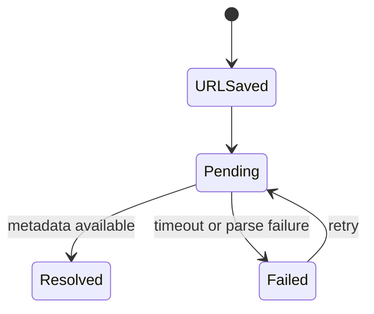
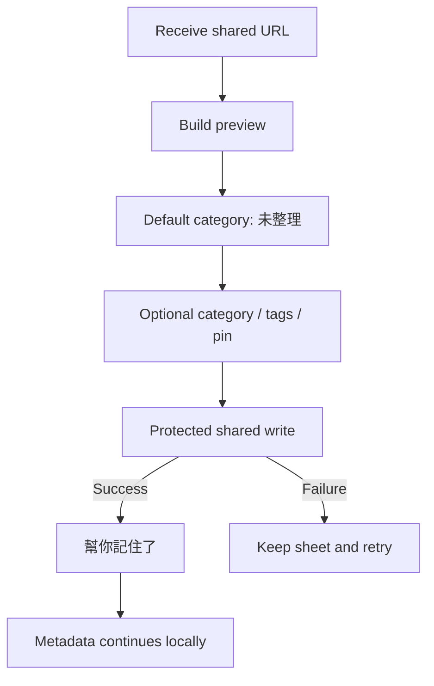

# 《等等看》Developer Handoff v1.0

| 項目 | 內容 |
|---|---|
| 文件狀態 | Phase 1 工程交付基準 |
| 產品版本 | v1.0 |
| 文件修訂 | 1.5（2026-07-21 備份技術架構去綁定與決策補完） |
| UI 依據 | High Fidelity UI v1.1 Final |
| 儲存範圍 | 本機優先；主 App／Share Extension／App Group 為待建立方向，尚未實作 |
| 下一階段 | Technical Architecture 與 Repository／Reuse Analysis |

## 1. Engineering Boundary

本文件由 ChatGPT（小居）確認產品／系統規格，並由 ChatGPT Work 完成跨文件整理與一致性治理。本文件定義邏輯資料模型、狀態、商業規則、驗證、流程與非功能需求。實際持久化框架、Repository 實作、URL Metadata 解析方案與通知排程策略，須由 GitHub Copilot（小摳）完成 Repository／官方能力／成熟方案研究後定案，再指定 Claude Code 或 Codex（阿克／扣哥）其中一位實作。

Phase 1 不得加入：

- 自建 Server、會員或帳號系統。
- Apple、Google、Email 或其他登入，以及 OAuth。
- CloudKit、Google Drive API、Dropbox API、OneDrive API 或其他雲端儲存整合。
- 自動備份、自動同步、跨裝置同步或《等等看》代管備份。
- Firebase、Push Server 或遠端 APNs。
- AI、社群、Todo、任務或排程功能。
- Widget。
- IAP、會員、訂閱、付費牆、支付或購買流程。

## 2. Platform and Native Capabilities

建立 Xcode 專案時優先評估 Apple 原生能力：

- SwiftUI。
- NavigationStack。
- TabView。
- ScrollView／LazyVGrid。
- Menu。
- Share Extension（尚未建立）。
- App Group shared container（尚未建立）。
- UserNotifications／`UNCalendarNotificationTrigger`。
- `UIActivityViewController` 或符合部署版本的原生分享能力。
- SwiftUI `fileExporter`／`fileImporter`、`UIDocumentPickerViewController` 或部署版本對應的原生文件能力。
- Uniform Type Identifiers。
- 持久化候選包含 SwiftData、Core Data、原生 SQLite 與 GRDB；均尚未選定。

Apple 原生能力優先。任何第三方套件，包括 GRDB、Nuke 或其他圖片／資料套件，必須在 Xcode 專案建立後依實際需求、相容性、安全、維護成本與原生替代方案評估，現階段不得視為已採用依賴。

## 3. App Group

本節是 Phase 1 產品需求方向，不表示 Repository 已存在 App Group、Share Extension、entitlement 或共享 store。目前 Xcode Project、Swift 程式碼、Share Extension、App Group、持久化 store、測試 Target 與 Migration 機制均尚未建立。

### 3.1 Requirements

- 主 App 與 Share Extension 必須使用同一 App Group entitlement。
- 建立後的共享資料能力須成為主 App 與 Share Extension 一致的本機資料來源；具體持久化方式待選型。
- Bookmark、Category、Tag、BookmarkTag、Settings 與必要 Metadata 狀態必須能由兩個 Target 讀寫。
- Share Extension 完成本機寫入後，主 App 必須可立即讀取。
- Schema migration 需由兩個 Target 共用同一版本定義。

### 3.2 Write Safety

- 使用交易、context save 或其他可證明一致的寫入方式。
- Extension 不得先回報成功再寫入。
- 寫入失敗不得建立半筆 Bookmark 或孤立 BookmarkTag。
- Extension 與主 App 同時寫入時不得覆蓋彼此已提交資料。
- 持久化初始化與 migration 需具程序間競態保護；具體鎖實作待選型，不在本文件指定。

## 4. Logical Data Model

所有日期使用絕對時間儲存；顯示時依使用者 Locale／Time Zone 格式化。ID 建議使用 UUID。實際型別映射由 Technical Architecture 定案。

### 4.1 Bookmark

| Field | Type | Required | Default | Rule |
|---|---|---:|---|---|
| `id` | UUID | Yes | Generated | Primary identifier |
| `originalURL` | URL/String | Yes | — | 原始內容網址；不得因 Metadata 失敗清除 |
| `title` | String? | No | `nil` | 無標題時 UI 以 URL／domain 替代 |
| `source` | String? | No | `nil` | 網站或來源名稱 |
| `summary` | String? | No | `nil` | Metadata 描述；Phase 1 不由 AI 產生 |
| `imageURL` | URL/String? | No | `nil` | 預覽圖片位置；本機快取策略待 Technical Architecture 定案 |
| `reason` | String? | No | `nil` | 收藏理由；空白正規化後視為 `nil` |
| `categoryID` | UUID | Yes | 未整理 ID | 每則收藏只能有一個 Category |
| `isPinnedToBoard` | Bool | Yes | `false` | Share Extension 或 Detail 可更新 |
| `metadataState` | MetadataState | Yes | `pending` | `pending`／`resolved`／`failed` |
| `createdAt` | Date | Yes | Now | 建立時間，不因 Metadata 更新改變 |
| `updatedAt` | Date | Yes | Now | 使用者內容或 Bookmark 狀態變更時更新 |
| `lastOpenedAt` | Date? | No | `nil` | 進入 Detail 或開啟原文時更新；列表曝光不更新 |

### 4.2 Category

| Field | Type | Required | Default | Rule |
|---|---|---:|---|---|
| `id` | UUID | Yes | Generated | Primary identifier |
| `name` | String | Yes | — | 顯示名稱；空白不可保存 |
| `isSystem` | Bool | Yes | `false` | 「未整理」為系統分類 |
| `sortOrder` | Integer | Yes | Next | 首頁排序；管理流程尚未定案 |
| `createdAt` | Date | Yes | Now | 建立時間 |
| `updatedAt` | Date | Yes | Now | 名稱或順序更新時間 |

#### System Category: 未整理

- App 首次建立資料庫時必須存在。
- 所有 Bookmark 都必須有有效 `categoryID`。
- Share Extension 未選分類時使用此 ID。
- 是否允許改名或刪除尚未定案；Phase 1 實作前必須由產品決定。

### 4.3 Tag

| Field | Type | Required | Default | Rule |
|---|---|---:|---|---|
| `id` | UUID | Yes | Generated | Primary identifier |
| `name` | String | Yes | — | 使用者輸入名稱；空白不可保存 |
| `createdAt` | Date | Yes | Now | 建立時間 |
| `updatedAt` | Date | Yes | Now | 名稱更新時間 |

Category 與 Tag 可同名。Tag 同名去重、大小寫及 Unicode 正規化規則尚未定案。

### 4.4 BookmarkTag

| Field | Type | Required | Rule |
|---|---|---:|---|
| `bookmarkID` | UUID | Yes | Foreign key → Bookmark |
| `tagID` | UUID | Yes | Foreign key → Tag |
| `createdAt` | Date | Yes | 關聯建立時間 |

Constraints：

- `(bookmarkID, tagID)` 必須唯一。
- Bookmark 刪除時 cascade 刪除 BookmarkTag。
- Tag 刪除時移除關聯，不刪除 Bookmark。
- 不允許孤立關聯。

### 4.5 Settings

使用單一 AppSettings record 或等效 Key-Value abstraction。不可把系統通知權限當成可自行寫入的真實值。

| Field | Type | Required | Default | Rule |
|---|---|---:|---|---|
| `homeNote` | String | Yes | Empty | 全 App 唯一首頁便條紙內容 |
| `dailyRecallEnabled` | Bool | Yes | `false` | 使用者意圖；實際可用性仍依系統權限 |
| `dailyRecallHour` | Integer | Yes | `20` | 0…23 |
| `dailyRecallMinute` | Integer | Yes | `0` | 0…59 |
| `hasSeenDailyRecallPrompt` | Bool | Yes | `false` | 防止重複邀請 |
| `dailyRecallPromptDismissedAt` | Date? | No | `nil` | 使用者選「先不用」時記錄 |
| `onboardingCompleted` | Bool | Yes | `false` | 完成第三頁後寫入 |
| `lastBackupAt` | Date? | No | `nil` | 成功匯出備份時設為當次建立日期；成功還原時設為匯入 envelope 的 `createdAt` |

以下不得作為持久化真實來源：

- Light／Dark：跟隨系統。
- Notification authorization：每次由 `UNNotificationSettings` 讀取。
- 使用者目前 Tab 或暫時 Loading：UI State。

### 4.6 Daily Recall Selection State

Phase 1 可使用瞬時狀態；若為避免同日重複而持久化，建議邏輯欄位如下，實際是否落盤由 Technical Architecture 決定：

| Field | Type | Purpose |
|---|---|---|
| `generatedForDate` | LocalDate/String | 今日批次日期 |
| `bookmarkIDs` | [UUID] | 目前顯示候選 |
| `generationSeed` | String/Integer? | 可重現取樣，選填 |

## 5. Enumerated States

### 5.1 MetadataState

```text
pending  -> resolved
pending  -> failed
failed   -> pending   (manual or scheduled retry)
pending  -> failed    (timeout/unrecoverable fetch)
```

| State | Meaning | Required UI |
|---|---|---|
| `pending` | URL 已保存，Metadata 擷取中 | Skeleton、URL、擷取中 |
| `resolved` | 可用 Metadata 已完成 | 標題／來源／圖片；缺欄位仍可為空 |
| `failed` | 本次擷取失敗 | URL 已保留、穩定 Placeholder、可重試 |

`resolved` 不代表每個欄位都有值；網站可能合法地沒有圖片或標題。

### 5.2 NotificationAuthorizationState

由 iOS 系統回傳並映射：

- `notDetermined`
- `denied`
- `authorized`
- `provisional`（若部署策略使用）
- `ephemeral`（如 API 回傳；一般 App 不依賴）

UI 至少區分：未詢問、可用、權限未開。

### 5.3 DailyRecallState

| State | Definition |
|---|---|
| `notEligible` | 尚未達邀請條件 |
| `eligible` | 可顯示邀請卡 |
| `promptDismissed` | 使用者選「先不用」 |
| `permissionRequired` | 使用者有啟用意圖，系統尚未授權 |
| `enabled` | 使用者啟用且系統允許，排程存在 |
| `disabled` | 使用者關閉或未啟用 |
| `permissionDenied` | 使用者啟用意圖存在，但系統拒絕 |
| `scheduleError` | 權限允許但排程建立失敗 |

### 5.4 Bookmark Content States

- Has image／No image。
- Has title／No title。
- Has reason／No reason。
- Has tags／No tags。
- Pinned／Not pinned。
- URL only。
- Metadata pending／resolved／failed。

### 5.5 UI States

所有可互動元件至少支援：

- Default。
- Pressed。
- Focused（輸入）。
- Filled（輸入）。
- Disabled。
- Loading。
- Error。
- Empty。

## 6. Business Rules

### BR-001 Local First

Phase 1 所有使用者資料儲存在本機；Xcode 專案建立後，主 App 與 Share Extension 共享所需資料的方向為 App Group shared container。目前 App Group 尚未建立，且不要求帳號或登入。

### BR-002 Bookmark Completion

`originalURL` 與有效 `categoryID` 寫入成功即視為收藏完成。Metadata、Tag、Reason 與洞洞板均不得阻擋完成。

### BR-003 Default Category

未選 Category 時必須使用「未整理」，不得讓 Category 為 `nil`。

### BR-004 Category Cardinality

每則 Bookmark 恰有一個 Category。

### BR-005 Tag Cardinality

每則 Bookmark 可有 0…n 個 Tag；透過 BookmarkTag 關聯。

### BR-006 Category and Tag Names

Category 與 Tag 允許同名；UI 必須以區塊標題與不同元件呈現。

### BR-007 Reason Optionality

Reason 為選填。無 Reason 時詳細頁與洞洞板不顯示空白便利貼或強迫填寫提示。

### BR-008 Pinning

Bookmark 可由 Share Extension 或 Detail 設為 Pinned；取消釘選只改變 `isPinnedToBoard`，不刪除資料。

### BR-009 Last Opened Time

- Bookmark 建立時 `lastOpenedAt = nil`。
- 進入 Bookmark Detail 時更新為 Now。
- 點擊開啟原文時更新為 Now。
- 列表、搜尋、洞洞板或 Daily Recall 卡片曝光不更新。

### BR-010 Metadata Independence

Metadata 擷取不得延遲或回滾已完成的本機收藏。

### BR-011 Daily Recall Purpose

Daily Recall 只邀請重新觀看收藏，不建立完成狀態、任務或排程。

### BR-012 Notification Permission

只有使用者點「每天提醒我」或在設定主動啟用時才能呼叫通知權限；Onboarding 不得要求。

### BR-013 Daily Frequency

每日一次，預設 20:00；只允許修改單一時間。不支援每週、多次、多組或間隔。

### BR-014 Notification Route

點擊 Daily Recall 通知直接進今日回顧。

### BR-015 Export Ownership

CSV／JSON 匯出對所有使用者開放，不得設為支持或付費功能。

### BR-015A User-managed Backup

- 專用備份檔匯出與匯入還原對所有使用者開放。
- 備份檔由使用者透過 iOS 系統介面自行保存與管理；App 不取得雲端帳號、不串接 File Provider API，也不追蹤最終儲存位置。
- `lastBackupAt` 代表目前資料最近對應的備份建立日期；來自成功匯出或成功還原，不代表該外部檔案仍存在。

### BR-015B Restore Safety

- Phase 1 匯入模式為取代目前資料。
- 必須在正式資料之外完成完整解析、版本驗證、必要欄位驗證、關聯驗證與候選資料寫入。
- 只有全部成功才可透過受保護程序切換；任何失敗、取消或中斷均不得清空或部分修改現有資料。
- 未確認重複資料判定前不得實作合併匯入。

### BR-016 Business Model

- Phase 1 核心收藏功能永久免費。
- Phase 1 不得加入 IAP、會員、訂閱、付費牆、支付或購買流程。
- 未來若實作自願支持，不得解鎖功能或改變既有使用額度。
- 未來付費服務只能針對 Phase 1 之後新增且具有持續成本的服務，例如跨裝置同步。
- 不得將 Phase 1 已提供的核心功能改為付費。

### BR-017 Single Home Note

全 App 只有一筆 Home Note；不建立列表、第二頁或 Tab。

### BR-018 Theme

App 外觀跟隨 iOS；不保存 App 內 Light／Dark 選項。

### BR-019 No Account or Sync Architecture

Phase 1 不建立登入、OAuth、會員、帳號 Token、自有 Server、自動雲端備份或同步架構；未來同步不得以未使用的 Phase 1 Schema、Service 或空 Scaffold 預留。

## 6.1 Business Model Engineering Boundary

### Phase 1

- 不建立 StoreKit Product。
- 不加入 StoreKit Framework 依賴作為 Phase 1 功能需求。
- 不建立購買、恢復購買、訂閱狀態、Receipt 驗證或 Entitlement。
- 不建立會員資料模型、付費狀態欄位或功能限制判斷。
- 不加入付費入口、Paywall 或支持購買流程。
- High Fidelity UI 中的「支持木木」畫面只保留為未來設計參考，不進入 Phase 1 實作工作清單。

### Future Commercial Services

未來若確認自願支持或跨裝置同步等付費服務，必須另行建立 PRD、Interaction、Data Model、Store Configuration、安全與驗收規格。不得預先在 Phase 1 Schema 中加入未使用的付款欄位。

## 7. Validation

### 7.1 Bookmark

| Rule | Failure Handling |
|---|---|
| `originalURL` 必須可解析為允許的 URL scheme | 保留 Extension，顯示短錯誤，不寫入半筆資料 |
| `categoryID` 必須存在 | 回退至「未整理」；若系統分類不存在，先修復／建立後交易寫入 |
| `reason` 去除首尾空白後為空 | 儲存為 `nil` |
| `lastOpenedAt` 不得早於不合理系統界線 | 不由使用者輸入；以系統 Now 寫入 |
| `createdAt` 不可由 Metadata 覆寫 | 保留原值 |

### 7.2 Category

- 名稱去除首尾空白後不可為空。
- 系統分類「未整理」必須存在且 ID 穩定。
- Category 刪除時 Bookmark 轉移規則尚未定案，未確認前不得實作刪除。

### 7.3 Tag

- 名稱去除首尾空白後不可為空。
- 單一 Bookmark 不得建立重複 `(bookmarkID, tagID)`。
- Tag 正規化與全域同名策略未定案。

### 7.4 Daily Recall Time

- Hour：0…23。
- Minute：0…59。
- 依使用者目前 Calendar／Time Zone 建立排程。
- 時區改變後的排程行為需在 Technical Architecture 與 QA 明確測試。

### 7.5 Export

- 匯出前以一致性快照讀取資料。
- 每列 Bookmark 必須能解析 Category；異常關聯不得造成整批靜默缺漏。
- JSON `lastOpenedAt` 可為 `null`；CSV 為空欄。
- URL、Reason 與 Tag 中的逗號、換行、引號必須正確 escaping。

### 7.6 Backup File

- 檔案必須為可辨識的《等等看》單一 JSON 備份 envelope，不得直接備份或搬移資料庫／store 檔案，也不得使用 ZIP 或 package。
- 檔案大小上限為 50 MB，必須在讀取內容前完成大小檢查。
- 第一版 `schemaVersion` 與 `modelVersion` 均為整數 `1`。
- 必填 metadata：`createdAt`、`appVersion`、`bookmarkCount`。
- 必須包含 payload 的 SHA-256 checksum；checksum 只用於完整性驗證，不代表加密、簽章或身分驗證。
- `bookmarkCount` 必須與資料區實際 Bookmark 筆數一致。
- 必須驗證 Bookmark、Category、Tag、BookmarkTag、Settings 的必要欄位、型別、ID 唯一性與外鍵完整性。
- 必須確認系統分類「未整理」可被正確還原或安全重建。
- 未知非必要欄位忽略；必要欄位缺失或型別錯誤則拒絕。
- 高於目前 App 支援的 `schemaVersion` 或 `modelVersion` 必須拒絕並提示更新 App；舊版只允許經明確 migration adapter 升級，不得猜測轉換。
- 解析、驗證與 staging 完成前不得修改正式 store。

## 8. Daily Recall Recommendation Logic

### 8.1 Inputs

- 全部未刪除 Bookmark。
- `createdAt`。
- `lastOpenedAt`。
- `isPinnedToBoard`。
- 當日已選 Bookmark IDs（若有）。

### 8.2 Candidate Pools

1. Recent：依 `createdAt` 由新到舊。
2. Long-unopened：
   - `lastOpenedAt != nil`：依最後開啟時間由舊到新。
   - `lastOpenedAt == nil`：收藏滿最低天數後視為從未開啟候選。
3. Pegboard：`isPinnedToBoard == true`。

### 8.3 Target Weight

- Recent 40%。
- Long-unopened 40%。
- Pegboard 20%。

比例為工程可微調權重，不是每一批必須精確整數配額；三個來源不得永久只剩 Recent。

### 8.4 Selection Rules

- 同一批不重複 Bookmark。
- 排除已刪除 Bookmark。
- 候選池不足時從其他可用池補齊。
- 點「換一批」時優先避開目前批次。
- 被顯示不更新 `lastOpenedAt`。
- 點入 Detail 才更新 `lastOpenedAt`。

### 8.5 Unresolved Parameters

- 每批顯示數量目前由 Final UI 示意為 3，是否固定仍需產品確認。
- 從未開啟候選的最低收藏天數未定。
- 同日換一批是否需跨 App 重啟保留排除清單未定。

## 9. Metadata Flow



### 9.1 Save Order

1. 驗證 URL。
2. 解析／取得有效 Category，缺省使用未整理。
3. 在單一交易建立 Bookmark、Tag 與 BookmarkTag。
4. Commit shared container。
5. 回饋收藏完成。
6. 進行 Metadata 擷取。
7. 只更新仍未被使用者手動修改的 Metadata 欄位。

### 9.2 Metadata Field Precedence

- 使用者手動編輯內容優先於後續擷取。
- Metadata retry 不得覆蓋使用者已編輯 Title／Reason／Category／Tags。
- 原始 URL 永遠保留。

### 9.3 Failure

- 設 `metadataState = failed`。
- 保留 Bookmark。
- UI 顯示 URL、Placeholder 與「網址已保留」。
- 不以無限重試消耗電量或網路。

## 10. Share Extension Flow



### 10.1 Extension Limits

- 不依賴主 App 正在執行。
- 避免大型記憶體圖片解碼。
- 不在 Extension 執行長時間背景任務。
- Extension 完成前必須確保資料已持久化。
- 必須處理主 App 與 Extension 同時存取 shared store。

## 11. Export

### 11.1 CSV

- UTF-8 with BOM。
- 第一列為穩定英文欄位名稱。
- 正確處理逗號、雙引號、CR/LF。
- `tags[]` 的單欄序列化分隔規則尚未定案。
- `lastOpenedAt == nil` 輸出空欄。

### 11.2 JSON

建議結構：

```json
{
  "schemaVersion": 1,
  "exportedAt": "2026-07-20T12:00:00Z",
  "bookmarks": [
    {
      "title": "東京住宿攻略",
      "originalURL": "https://example.com/tokyo",
      "source": "example.com",
      "category": "旅遊",
      "tags": ["東京", "住宿"],
      "reason": null,
      "createdAt": "2026-07-18T12:00:00Z",
      "lastOpenedAt": null,
      "isPinnedToBoard": false
    }
  ]
}
```

- 日期使用 ISO 8601。
- 不輸出內部 App Group path、系統 Token 或其他非使用者資料。
- 匯出檔建立於暫存位置，Share Sheet 結束後依保留政策清理。

## 12. Backup and Restore

### 12.1 Backup Envelope

Phase 1 固定使用單一 JSON 專用備份檔；檔名為 `等等看_Backup_YYYY-MM-DD_HHmm_v1.json`。資料匯出 JSON 與備份 JSON 是不同契約，不得互相冒充。備份資料必須由 Domain Model 產生，不得序列化資料庫 row、直接複製 store 檔或依賴特定持久化框架。

```json
{
  "schemaVersion": 1,
  "modelVersion": 1,
  "createdAt": "2026-07-21T12:00:00Z",
  "appVersion": "1.0.0",
  "bookmarkCount": 1,
  "payload": {
    "bookmarks": [],
    "categories": [],
    "tags": [],
    "bookmarkTags": [],
    "settings": {},
    "dailyRecallState": null
  },
  "payloadChecksum": {
    "algorithm": "SHA-256",
    "value": "<lowercase-hex>"
  }
}
```

`payloadChecksum.value` 以文件定義的 canonical JSON 規則序列化 `payload` 後，對其 UTF-8 bytes 計算 SHA-256。canonical 規則必須由工程文件與測試固定，確保匯出與匯入得到相同 bytes。checksum 僅檢查內容是否損毀，不提供機密性、來源證明或使用者身分驗證。

完整還原所需資料至少包括：

- Bookmark 全部持久欄位，包含 ID、URL、Metadata 狀態、Reason、Category 關聯、洞洞板狀態、`createdAt`、`updatedAt`、`lastOpenedAt`。
- Category，包含系統「未整理」識別與使用者排序資料。
- Tag 與 BookmarkTag 關聯。
- Home Note、Onboarding 完成狀態、Daily Recall 使用者設定及必要 App Settings；不把裝置作業狀態 `lastBackupAt` 當成使用者內容欄位。
- 如 Daily Recall Selection State 僅為可重新產生的瞬時資料，可不備份；若已持久化，需明確標示是否納入並保持向後相容。
- 不包含通知授權狀態、暫時 UI State、App Group path、快取檔、log、系統 Token 或雲端帳號資訊。

### 12.2 Image Boundary

- Phase 1 JSON 備份不封裝任何圖片二進位檔。
- 只保存圖片 URL、Metadata 與可恢復資料欄位；可重新產生的縮圖與 image cache 不屬於備份契約。
- 不得加入 Base64、ZIP、package 或圖片附件。

### 12.3 Export Backup Flow

1. 透過 Repository／Domain 介面取得一致的 Domain Model snapshot；不得直接讀取或搬移底層資料庫檔案。
2. 建立並驗證 envelope，確認 `bookmarkCount` 與關聯完整。
3. 串流寫入 App 暫存區，完成後再交給原生 File Exporter／Share Sheet。
4. 使用者可選擇 iCloud Drive、我的 iPhone 或已安裝的第三方 File Provider；App 不辨識、不綁定也不呼叫其 API。
5. 只有系統回報成功完成匯出時更新 `lastBackupAt`；取消或失敗不更新。
6. 流程結束後依政策清理 App 暫存檔。

### 12.4 Import Validation Pipeline

1. 使用原生 Document Picker 取得 security-scoped file access；只在需要期間存取。
2. 在讀取內容前檢查檔案不超過 50 MB，再複製至 App 受控暫存區，避免直接修改來源檔。
3. 解析 envelope，驗證檔案格式、`schemaVersion`、`modelVersion`、SHA-256 checksum、metadata、筆數、必要欄位、資料型別、ID 與關聯完整性；忽略未知非必要欄位。
4. 對可支援的舊版本執行明確 migration adapter；高於目前支援版本時拒絕並提示更新 App。不得猜測轉換。
5. 驗證成功後才向 UI 提供備份日期與收藏筆數預覽。

### 12.5 Protected Replacement

1. 使用者明確確認「取代目前資料」後才開始。
2. 在與正式資料隔離的 staging 區建立完整候選 Domain Model，再由已選持久化方案寫入候選 store。
3. 執行版本、關聯、系統分類、筆數、checksum 與必要完整性檢查。
4. 全部成功後，依最終持久化框架提供的交易、context 切換、受保護 store publication 或其他可證明等效的方式取代目前資料；不得把資料庫檔案 rename／swap 視為固定契約。
5. 發布期間以架構無關的 exclusive write gate 鎖定主 App 與 Share Extension 的所有資料寫入；Extension 需顯示暫時無法收藏／可重試。純瀏覽功能不需鎖定。具體程序間協調方式待 Xcode 專案與持久化選型完成後決定。
6. 成功後重新建立 Repository／View State，重新排程依匯入設定決定的本機通知，並刪除 staging。
7. 成功還原後將本機 `lastBackupAt` 設為備份 envelope 的 `createdAt`，表示目前資料最近對應的備份建立日期。
8. 任一步驟失敗即 rollback 或丟棄 staging；原正式資料保持不變。匯入流程不會自動在使用者的檔案 App 產生額外備份。

### 12.6 Import Error Codes

| Logical Code | Condition | User-facing Result |
|---|---|---|
| `backup.invalidFormat` | 非專用備份或 JSON 無法解析 | 無法讀取這份備份；原本資料仍保留 |
| `backup.fileTooLarge` | 檔案超過 50 MB | 這份備份超過可匯入大小；原本資料仍保留 |
| `backup.unsupportedVersion` | schema／model version 太新或無 migration adapter | 請更新《等等看》後再匯入；原本資料仍保留 |
| `backup.checksumMismatch` | SHA-256 checksum 不符 | 備份可能不完整或已損毀；原本資料仍保留 |
| `backup.missingField` | 必要欄位缺少或型別錯誤 | 備份內容不完整；原本資料仍保留 |
| `backup.integrityFailed` | ID、外鍵、筆數或系統分類不一致 | 備份內容不完整；原本資料仍保留 |
| `backup.readFailed` | File Provider／權限／I/O 問題 | 無法開啟檔案；可重新選擇 |
| `backup.restoreFailed` | staging、migration adapter 或受保護取代失敗 | 沒有完成匯入；原本資料仍保留 |

錯誤 log 不得包含收藏原文、Reason、Tag、完整 URL 或備份檔內容。

## 13. Notification Rules

### 13.1 Permission

- Onboarding 禁止請求。
- 只有明確點擊啟用動作才呼叫 `requestAuthorization`。
- `denied` 時顯示系統設定入口。
- App 進入前景或返回設定頁時重新讀取通知權限。

### 13.2 Schedule

- Identifier 必須穩定且可精確移除，例如 `dailyRecall.primary`。
- 啟用或改時間時先移除既有 Pending Request，再建立新 Request。
- 關閉時移除 Pending Request。
- 每日一次，預設 20:00。
- Notification `userInfo` 包含 `route = dailyRecall`。

### 13.3 Copy

文案從已確認清單選擇，不得使用「待辦」「完成」或催促語氣。若要求每日輪播，單一 repeating notification 無法自然更換每日內容；排程策略須在 Technical Architecture 定案，不得為了輪播引入 Server。

## 14. Migration

### 14.1 General Rules

- 備份 envelope 相容性變更提高 `schemaVersion`；Domain Model 相容性變更提高 `modelVersion`。第一版均為 `1`。
- 底層持久化 migration 版本由最終選定框架另行管理，不得直接等同備份 `schemaVersion` 或 `modelVersion`。
- Migration 必須在未來建立的主 App 與 Share Extension 間一致理解。
- Migration 前不得破壞原資料。
- 失敗時不得建立空 store 覆蓋舊 store。
- 建議保留可恢復備份或使用持久化框架的安全 migration 能力。

### 14.2 `lastOpenedAt` Migration

- 新增 nullable Date 欄位。
- 所有既有 Bookmark 回填 `nil`。
- 不得以 `createdAt` 假裝最後開啟時間。
- Migration 後 Daily Recall 將這些資料視為從未開啟，須套用最低收藏天數規則。

### 14.3 System Category Migration

- 確認「未整理」存在。
- 任何缺少有效 Category 的 Bookmark 必須轉至「未整理」。
- 不刪除使用者資料。

### 14.4 Backup Settings Migration

- 新增 `lastBackupAt` 時預設為 `nil`，UI 顯示「尚未備份」。
- 不得以一般 CSV／JSON 匯出日期、App 安裝日期或資料庫修改日期回填。

## 15. Security and Privacy Notes

### 15.1 Data Classification

收藏 URL、Reason、Tag 與 Home Note 可能包含私人生活資訊，視為使用者私人資料。

### 15.2 Storage

- Shared container 使用 iOS Data Protection 能力。
- 不將完整收藏資料寫入 Console、Analytics 或 Crash log。
- 不在通知內容中顯示敏感收藏標題；Final 文案採一般性文字。
- 匯出檔可能含私人資料，僅由使用者主動觸發。

### 15.3 URL Handling

- 僅允許明確支援的 URL scheme；不得直接執行任意 deep link 或 script scheme。
- UI 顯示 URL 時做文字處理，不解析為 HTML。
- 開啟外部 URL 使用系統安全 API。
- Metadata 內容視為不可信輸入，需限制長度並避免 HTML／script 注入到任何 WebView。

### 15.4 Share Extension

- App Group 建立後，其 identifier 不得提交錯誤環境或 Team 設定；目前尚無 identifier、entitlement 或 Target。
- 不在 Extension 暴露 secret；Phase 1 不需要 Server credential。

### 15.5 Export and Backup

- 匯出暫存檔完成分享後清理。
- 備份與匯入暫存檔完成或失敗後清理；不得加入一般 iCloud container 自動同步。
- 使用 security-scoped URL 時必須成對開始／停止存取。
- App 不保存 File Provider credential、不記錄使用者選擇的雲端服務，也不宣稱備份檔由《等等看》代管。
- 檔名不得包含使用者私人內容。
- 錯誤 log 不記錄 URL、Reason 或 Tag 原文。
- checksum 只供檔案完整性檢查，不得宣稱為加密、簽章或身分驗證。

### 15.6 Third-party Dependencies

Apple 原生能力優先。Xcode 專案建立後，研究任何 Package 時必須檢查：維護狀態、License、安全紀錄、依賴負擔、資料傳輸、隱私與是否真的優於原生能力。GRDB、Nuke 與其他第三方套件目前均尚未選定。

## 16. Performance Notes

- 分類與搜尋列表使用 Lazy container，不一次實體化所有卡片。
- 圖片載入需限制解碼尺寸、快取上限與記憶體使用。
- Share Extension 不下載大型圖片後再完成收藏。
- 搜尋需避免每次鍵入進行昂貴全資料重算；採 debounce 或本機索引策略由 Technical Architecture 決定。
- Metadata retry 需有次數／退避上限。
- App 啟動不等待網路。
- Daily Recall 候選只在需要時產生，避免每次畫面刷新全量排序。
- 匯出大量資料使用串流／分批編碼或背景工作，避免一次建立巨大記憶體物件。
- 備份檔上限 50 MB；在讀取內容前先檢查大小。匯出與匯入避免不必要地同時保留多份完整 payload，並使用可控 staging。
- 測試至少包含 0、1、100、1,000、10,000 筆 Bookmark 的列表、搜尋、回顧、匯出與備份／還原。

## 17. Error Recovery

| Failure | Required Behavior |
|---|---|
| Shared store init failure | 阻擋寫入、保留原檔、顯示可理解錯誤 |
| Share write failure | Extension 保持開啟、允許重試、不回報成功 |
| Metadata failure | Bookmark 與 URL 保留，標記 failed |
| Image load failure | 使用 Placeholder Token |
| Notification permission denied | 顯示前往系統設定，不重複彈系統視窗 |
| Schedule failure | 不顯示已啟用假狀態，允許重試 |
| Export failure | 不開啟空 Share Sheet，清理不完整暫存檔 |
| Backup export failure／cancel | 不更新 `lastBackupAt`，清理 App 內暫存檔，正式資料不變 |
| Backup exceeds 50 MB | 讀取內容前拒絕，原資料不變 |
| Backup checksum mismatch | 拒絕匯入，原資料不變；不得宣稱 checksum 可驗證身分 |
| Backup newer than App | 拒絕匯入並提示更新 App，原資料不變 |
| Import validation failure | 不要求覆蓋確認，不修改正式資料，說明原資料仍保留 |
| Restore failure／interruption | rollback／丟棄 staging，正式 store 保持不變 |
| Delete failure | Bookmark 保留，畫面回復一致狀態 |

## 18. Accessibility Engineering

- 所有主要文字使用 iOS Text Style／Dynamic Type。
- 最小實際產品字級 Caption 12 pt；不得以 8–9 px 實作。
- 觸控區至少 44 × 44 pt。
- 洞洞板在 Accessibility Large 起支援單欄。
- 使用者輸入文字不可無提示截斷。
- Placeholder、Error、Selected 不只依賴顏色。
- VoiceOver label 不朗讀裝飾字元。
- Reduce Motion 下停止 Skeleton 流光與非必要動畫。

## 19. Test Matrix

### 19.1 Required Functional Tests

- Share Extension 零操作收藏。
- 未整理不存在時的修復與收藏。
- 0／1／多個 Tag。
- Category 與 Tag 同名顯示。
- Metadata pending／resolved／failed／無圖片／無標題。
- Detail 進入與開啟原文更新 `lastOpenedAt`。
- 列表曝光不更新 `lastOpenedAt`。
- Pin／Unpin 不刪除 Bookmark。
- Daily Recall 邀請、先不用、允許、拒絕、系統設定返回。
- 修改時間、關閉通知、冷啟動 notification route。
- Recommendation 三個候選池與不足補位。
- CSV／JSON escaping、null、10,000 筆匯出。
- 備份 envelope metadata、所有持久資料與關聯完整性。
- 成功匯出時寫入當次建立日期；成功還原時寫入 envelope `createdAt`；取消與失敗不更新 `lastBackupAt`。
- 匯入格式錯誤、欄位缺失、筆數不符、外鍵錯誤、版本過新與檔案存取失敗。
- 使用者取消取代、staging 寫入失敗、migration adapter 失敗與發布中斷時，原資料語意一致地保留。
- 匯入期間主 App／Share Extension 所有寫入被鎖定，純瀏覽仍可用。
- Migration 將既有 `lastOpenedAt` 回填 nil。

### 19.2 Required UI Matrix

- Light／Dark。
- 標準 Dynamic Type／Accessibility 最大測試尺寸。
- VoiceOver。
- Increase Contrast。
- Reduce Motion。
- iPhone Safe Area 與不同寬度。

## 20. Technical Acceptance Criteria

- [ ] Xcode Project、主 App Target、Share Extension Target 與 App Group 建立後，兩者可讀寫同一共享本機資料來源。
- [ ] Share Extension 寫入成功後主 App 可立即看到 Bookmark。
- [ ] Metadata 失敗不造成資料遺失或卡片破版。
- [ ] Bookmark、Category、Tag、BookmarkTag 關聯完整且無孤立資料。
- [ ] `lastOpenedAt` 更新點與不更新點符合 BR-009。
- [ ] Daily Recall 不需要網路或 Server。
- [ ] 通知點擊直接進今日回顧。
- [ ] 匯出包含 `lastOpenedAt` 且可處理 null。
- [ ] 專用備份為單一 JSON，檔名符合規則，且含 `schemaVersion: 1`、`modelVersion: 1`、建立日期、App 版本、收藏數量、payload 與 SHA-256 checksum。
- [ ] 讀取前執行 50 MB 大小檢查；未知非必要欄位忽略，必要欄位缺失拒絕。
- [ ] 新版備份拒絕並提示更新 App；舊版只有明確 migration adapter 才可升級。
- [ ] 匯入先驗證並預覽，只有使用者確認且 staging 全部成功後才執行受保護取代。
- [ ] 所有匯入失敗與取消案例均保留現有資料。
- [ ] 匯入不會自動在使用者的檔案 App 產生額外備份。
- [ ] Phase 1 備份不含圖片二進位檔，只含圖片 URL、Metadata 與可恢復欄位。
- [ ] 不含 Apple／Google／Email 登入、OAuth、CloudKit、Google Drive API、自有 Server、自動備份或同步架構。
- [ ] 不含登入、同步、AI、Todo 或 Widget。
- [ ] 不含 StoreKit、IAP、會員、訂閱、Paywall 或購買流程。
- [ ] HTML Final 中已確認的 Light／Dark、Dynamic Type 與 44 pt 規則被落實。
- [ ] 所有必要自動化測試與 GitHub Actions 檢查通過。

## 21. Safety Review

| 項目 | 狀態 | 說明 |
|---|---|---|
| Authentication | N/A | Phase 1 無帳號 |
| Authorization | N/A／App sandbox | 單一裝置使用者；App Group 與兩個 Target 尚未建立，建立後僅限必要元件 |
| Private data | Action required | 使用 Data Protection、避免敏感 log 與通知內容 |
| Destructive delete | Action required | Alert 確認、交易刪除、失敗回復 |
| Export／backup privacy | Action required | 主動觸發、暫存清理、無隱藏欄位、不保存 File Provider 帳號或位置 |
| URL input | Action required | Scheme allowlist、長度限制、Metadata 不可信 |
| Migration | Blocking until tested | 不得以空 store 覆蓋舊資料 |
| Backup restore | Blocking until tested | 驗證、staging、架構無關寫入鎖、受保護取代及 rollback 必須完整通過 |
| Third-party packages | Pending next gate | 小摳需完成 reuse／license／security 研究；完成前不得交付阿克／扣哥 Coding |

## 22. Open Engineering Issues

| ID | Issue |
|---|---|
| DEV-I01 | SwiftData、Core Data、原生 SQLite 或 GRDB 的持久化方案，以及 App Group shared container 實作，須在 Xcode 專案建立時評估；目前均未選定／未實作。 |
| DEV-I02 | Daily Recall 邀請確切收藏門檻未定。 |
| DEV-I03 | 從未開啟候選最低天數與每批固定數量未定。 |
| DEV-I04 | 十則通知每日輪播的本機排程策略未定，不得引入 Server。 |
| DEV-I05 | 分類新增／改名／刪除／排序及刪除後 Bookmark 轉移規則未定。 |
| DEV-I06 | Tag 正規化與同名去重規則未定。 |
| DEV-I07 | Metadata 圖片快取策略與保留上限未定。 |
| DEV-I08 | CSV `tags[]` 單欄格式未定。 |
| DEV-I10 | Analytics 與隱私策略未定；Phase 1 不得假設有事件後端。 |
| DEV-I12 | 隱私權政策與使用條款的正式內容與公開 URL 待完成；完成前不得放置假連結。回報問題／提供建議已決定採 Email。 |

## 23. Revision History

| Date | Revision | Change |
|---|---:|---|
| 2026-07-21 | 1.5 | 將持久化與第三方套件降為候選；備份改為 Domain Model 單一 JSON，補齊 50 MB、schema/model version 1、SHA-256、migration adapter、架構無關 staging／寫入鎖／rollback 與圖片排除規則。 |
| 2026-07-20 | 1.4 | 定義專用備份資料結構、原生檔案介面、驗證、staging、跨程序鎖與原子性還原；禁止帳號、OAuth、CloudKit、雲端 API 與同步架構。 |
| 2026-07-20 | 1.3 | 同步 AI Team Workflow：小居規格、Work 文件治理、小摳研究、阿克／扣哥單一工程師實作、Actions 檢查、Jenny 驗收。 |
| 2026-07-20 | 1.2 | 與 Technical Architecture、Design、Interaction、PRD、README 及 Decision Log 完成商業邊界一致性同步。 |
| 2026-07-20 | 1.1 | 移除 Phase 1 StoreKit／IAP／會員與支持購買工程假設；確認核心功能永久免費，未來僅新增且有持續成本的服務可另行商業化。 |
| 2026-07-20 | 1.0 | 建立 Phase 1 Developer Handoff。 |
