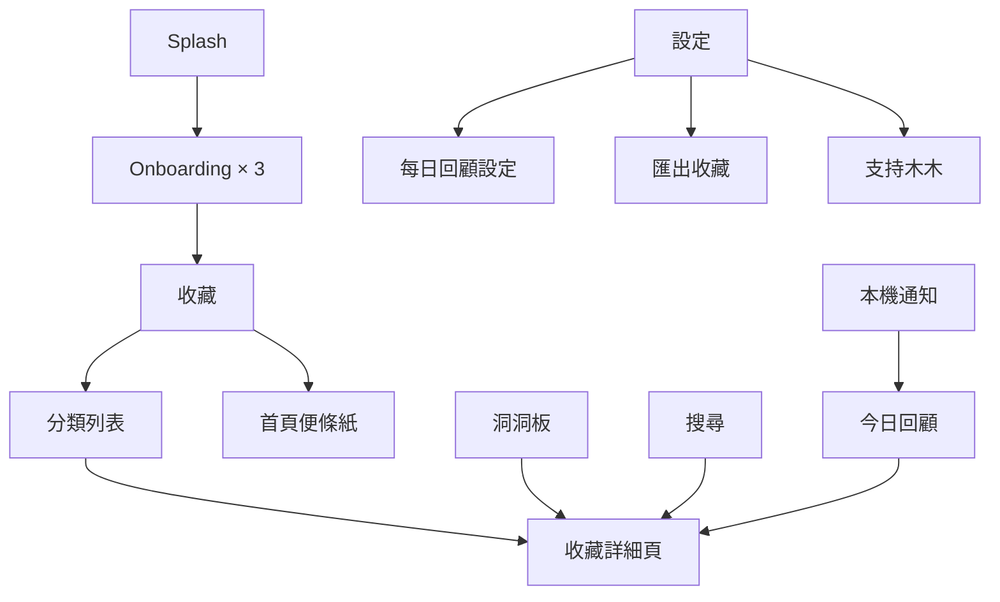

# 《等等看》Product Requirements Document v1.0

| 項目 | 內容 |
|---|---|
| 文件狀態 | Phase 1 開發基準 |
| 產品版本 | v1.0 |
| 平台 | iOS |
| 規格依據 | 產品核心原則、Design System v1.0、High Fidelity UI v1.1 Final |
| 優先順序 | 最新確認之 High Fidelity UI 與其 Developer Handoff 優先於早期草案 |

## 1. Product Vision

《等等看》是一個安靜、可信任的生活收藏空間。使用者看到任何喜歡或可能想再看的內容時，只需先保存，之後能透過分類、標籤、搜尋、洞洞板與每日回顧重新找到。

產品的核心不是安排使用者做事，而是降低遺忘與找不到的焦慮：幫助記住，而不是幫助安排。

## 2. Product Positioning

《等等看》定位為生活靈感收藏 App。

- 不是 Todo App。
- 不是任務管理或排程工具。
- 不是 AI App。
- 不是社群平台。
- 不是內容推薦平台。
- 不是強調整理效率的收藏管理 Dashboard。

產品價值由三件事構成：

1. 收藏速度：從 iOS 分享選單以最少步驟完成保存。
2. 找回能力：透過分類、標籤與搜尋再次找到內容。
3. 重新相遇：透過洞洞板與每日回顧重新看到曾經收藏的內容。

## 3. Product Principles

1. 先收藏，再整理。
2. 少填資料，多使用圖片。
3. 收藏速度優先於資料完整性。
4. 分類是主要歸類；標籤是自由補充。
5. 洞洞板保留特別想留下來的內容。
6. 每日回顧是重新觀看收藏，不是待辦提醒。
7. 本機優先，不要求登入。
8. 功能少、低學習成本、長期可維護。
9. 不以焦慮、成就、連續天數或催促提高使用頻率。
10. 新增功能前必須檢查長期維護價值、使用者規模成本與核心價值依賴。

## 4. Target User

### 4.1 Primary User

日常會從 Safari、社群、訊息或其他 App 看到餐廳、旅遊、購物、學習、生活資訊，當下沒有時間閱讀或處理，但希望日後能找回的人。

### 4.2 User Characteristics

- 收藏來源分散於多個 App。
- 當下希望快速保存，不願填寫完整表單。
- 曾因收藏過多、分類混亂或平台搜尋不佳而找不到內容。
- 希望保留「當時為什麼喜歡」的生活脈絡。
- 不希望為基本收藏建立帳號或理解複雜系統。

## 5. User Problems

1. 喜歡的內容散落於瀏覽器書籤、社群收藏、聊天室與截圖。
2. 收藏當下步驟太多，導致放棄保存。
3. 收藏後缺乏清楚的分類與搜尋方式。
4. 即使成功收藏，也很少再次打開。
5. 只記得看過某個內容，卻不記得來源或存在哪裡。
6. 傳統工具容易呈現任務、排程或管理壓力，不符合生活靈感情境。

## 6. Product Goals

### 6.1 Phase 1 Goals

- 讓使用者不登入即可開始收藏。
- 讓 Share Extension 在零額外輸入下完成收藏。
- 讓 Metadata 不完整時仍能立即保存網址。
- 讓使用者能以分類、標籤與搜尋找回內容。
- 讓洞洞板保留特別想再次看到的收藏。
- 以每日一次的本機通知邀請使用者重新觀看收藏。
- 讓使用者能免費匯出自己的資料。
- 主 App 與 Share Extension 透過 App Group 即時共用本機資料。

### 6.2 Non-goals

- 不追求將每則收藏整理完整。
- 不建立社群互動、追蹤、分享牆或公開內容。
- 不建立任務、完成狀態、優先級或排程。
- 不以 AI 自動分析、摘要、分類或推薦內容。
- Phase 1 不提供帳號、登入或跨裝置同步。

## 7. MVP Scope

### 7.1 In Scope — Phase 1

- Splash。
- 三頁 Onboarding。
- 收藏首頁與單一首頁便條紙。
- iOS Share Extension。
- 收藏詳細頁。
- 分類與分類收藏列表。
- 自由標籤。
- 搜尋收藏、分類與標籤。
- 洞洞板。
- Daily Recall／每日回顧。
- iOS Local Notification。
- Metadata 擷取與穩定替代狀態。
- 剪貼簿網址偵測提示。
- 收藏資料匯出。
- 設定。
- 支持木木。
- Light Mode、Dark Mode、Dynamic Type 與無障礙。
- 完全本機儲存與 App Group shared container。

### 7.2 Out of Scope — Phase 1

- AI、聊天、摘要、自動標籤與 AI 推薦。
- 社群、公開頁面、好友或協作。
- Todo、任務、完成狀態、排程與生產力功能。
- 週提醒、多次提醒、多組提醒與間隔提醒。
- Server、Push Server、Firebase 與遠端 APNs 推播。
- Google 登入、Sign in with Apple 與自建帳號系統。
- 跨裝置同步與雲端備份宣稱。
- 桌面 Widget 與鎖定畫面 Widget。
- App 內 Light／Dark 切換。
- 首頁最近新增、最近瀏覽、大量收藏列表或 Carousel。

## 8. Information Architecture

Bottom Navigation 固定為四個 Tab，順序不可變：

1. 收藏
2. 洞洞板
3. 搜尋
4. 設定

首頁便條紙是收藏首頁頂部的固定元件，不是獨立頁面，也不是 Bottom Tab。

## 9. Core Features

### 9.1 App Launch and Onboarding

- Splash 顯示品牌後自動前進。
- 首次啟動顯示三頁 Onboarding：收藏、收藏理由、找回。
- Onboarding 不要求登入、不推銷、不要求通知權限。
- 完成後直接進入收藏首頁。

### 9.2 Home

首頁主結構固定為：

1. 頁面標題。
2. 單一首頁便條紙。
3. 分類入口。
4. Bottom Navigation。

首頁不顯示最近新增、最近瀏覽、收藏瀑布流或水平 Carousel。

首頁便條紙：

- 全 App 只有一張。
- 點擊原位編輯。
- 自動儲存。
- 不具備完成、日期、排程或提醒語意。

### 9.3 Share Extension

顯示內容：

- 預覽圖片或圖片替代狀態。
- 標題或網址替代文字。
- 分類。
- 標籤。
- 加入洞洞板。
- 「幫我記住」按鈕。

規則：

- 分類預設為系統分類「未整理」。
- 使用者不操作分類也能完成收藏。
- 每則收藏只有一個分類。
- 標籤預設空白，為選填，可為零個或多個。
- 加入洞洞板為選填，預設關閉。
- 「幫我記住」始終可用。
- 不顯示大型收藏理由輸入區或其他非必要欄位。
- 儲存以本機資料寫入成功為完成條件，不等待 Metadata 擷取完成。

### 9.4 Bookmark Detail

資訊順序：

1. 收藏圖片或替代狀態。
2. 標題。
3. 來源／網址。
4. 收藏理由便利貼；沒有內容時不顯示完整空白便利貼。
5. 分類。
6. 標籤。
7. 建立日期。
8. 釘到洞洞板／取消釘選。
9. 開啟原文。
10. 分享。
11. 編輯。
12. 刪除收藏。

進入詳細頁或點擊「開啟原文」時更新 `lastOpenedAt`。列表曝光、搜尋結果曝光與今日回顧推薦不更新此欄位。

### 9.5 Categories

- 分類是主要歸類方式。
- 每則收藏必須對應一個分類。
- 未指定時使用系統分類「未整理」。
- 收藏首頁以分類 Card 作為主要入口。
- Category Preview Card 左側顯示名稱與收藏數，右側顯示 2–4 張圖片預覽。
- 點擊分類進入分類收藏列表。
- 分類列表顯示返回、分類名稱、收藏數量、排序／篩選入口、收藏卡片與空狀態。

### 9.6 Tags

- 標籤是使用者自由建立的補充標記。
- 每則收藏可有零個或多個標籤。
- 不填標籤不影響收藏。
- 分類與標籤允許同名。
- UI 必須以「分類」與「標籤」標題區分，不可混排為同一段文字。

### 9.7 Search

- 搜尋是 Bottom Navigation 第三個獨立 Tab。
- 搜尋範圍包含收藏內容、分類與標籤。
- 收藏可依標題、原始網址、來源、收藏理由、分類與標籤被找到。
- 結果中的分類使用單一 Chip；標籤維持多個 Tag Chip。
- 無結果時顯示簡短空狀態與清除搜尋動作。
- 不提供熱門搜尋、趨勢或外部推薦。

### 9.8 Pegboard

- 洞洞板是 Bottom Navigation 第二個 Tab。
- 使用洞洞板視覺與卡片釘選效果，不改為一般列表。
- 卡片可顯示圖片、標題、來源、分類、標籤與收藏理由。
- 沒有收藏理由時不顯示空白便利貼區或引導文字。
- 有收藏理由時才增加便利貼內容區與卡片高度。
- 使用者可在 Share Extension 或收藏詳細頁加入洞洞板。
- 取消釘選只移出洞洞板，不刪除收藏。
- 大型 Dynamic Type 尺寸下可由雙欄改為單欄。

### 9.9 Daily Recall

每日回顧的目的，是邀請使用者重新看看自己的收藏，不是提醒完成事情。

#### 邀請時機

- 不在 Onboarding 顯示。
- 完成第一筆收藏後再次開啟 App，或收藏累積至 3–5 筆時顯示邀請卡。
- 邀請文案：
  - 標題：「每天提醒你回來看看收藏嗎？」
  - 副標：「有些好內容，值得在對的時間重新發現。」
  - 動作：「每天提醒我」「先不用」。
- 選「先不用」直接關閉，不要求通知權限。
- 選「每天提醒我」才向 iOS 要求通知權限。

#### 排程

- 使用 iOS Local Notification。
- 每日固定一次。
- 預設時間 20:00，可修改。
- 不支援每週、多次、多組或間隔提醒。
- 不需要 Server、Push Server、Firebase、遠端 APNs 或雲端同步。

#### 通知與路由

- 文案不得使用待辦、完成或催促語氣。
- 點擊通知直接進入「今日回顧」，不先回首頁。
- 今日回顧顯示一批收藏並提供「換一批」。

#### 推薦來源

- 40% 最近收藏。
- 40% 久未開啟收藏。
- 20% 洞洞板收藏。
- 久未開啟依 `lastOpenedAt` 判斷。
- `lastOpenedAt == nil` 表示從未開啟，達最低收藏天數後可納入高優先候選。
- 排除已刪除內容與同批重複；候選不足時由可用池補齊。
- 比例可於工程實作時微調，但不得改變三種來源均需納入的原則。

### 9.10 Metadata Flow

- 收藏成功只依賴原始網址寫入本機。
- 標題、來源、描述與圖片網址可在後續擷取。
- 支援 `pending`、`resolved`、`failed` 狀態。
- 必須支援僅網址、無圖片、無標題、擷取中與擷取失敗。
- 擷取失敗時保留原始網址並使用穩定替代卡，不得破版。

### 9.11 Clipboard URL Detection

- App 開啟時若偵測到剪貼簿網址，顯示可關閉的非阻擋式提示。
- 使用頂部提示列或輕量提示卡，不顯示大型 Modal。
- 只有點擊「加入」才進入收藏流程。

### 9.12 Export

- 所有使用者皆可使用，不列為付費限制。
- 支援 CSV 與 JSON。
- 檔案在本機建立，完成後開啟 iOS Share Sheet。
- 至少輸出：
  - `title`
  - `originalURL`
  - `source`
  - `category`
  - `tags[]`
  - `reason`
  - `createdAt`
  - `lastOpenedAt`
  - `isPinnedToBoard`
- 從未開啟時，`lastOpenedAt` 輸出空值或 `null`。

### 9.13 Settings

Phase 1 設定頁包含：

- 資料：匯出收藏。
- 每日回顧：啟用狀態與提醒時間。
- App：App 設定入口。
- 支持：支持木木。
- 關於：關於《等等看》與版本。

Phase 1 不顯示 Google 登入、Apple 登入、同步狀態或雲端備份宣稱。

### 9.14 Support Mumu

- 提供支持金額選項與購買動作。
- 固定說明「支持不會解鎖功能。」
- 不以支持行為限制資料匯出或其他既有功能。

## 10. State Requirements

必須提供：

- 首頁有內容／首次使用。
- 分類列表有內容／空狀態。
- 洞洞板有內容／空狀態。
- 洞洞板有理由／無理由卡片。
- 搜尋有結果／無結果。
- Metadata 擷取中／成功／失敗／僅網址／無標題／無圖片。
- 詳細頁有理由／無理由。
- 每日回顧邀請／已啟用／權限未開／今日回顧。
- Loading、Disabled、Pressed、Focused、Error。
- Light／Dark 與標準／Accessibility Dynamic Type。

## 11. Phase 1

Phase 1 採完全本機儲存：

- 不登入。
- 不顯示 Google 或 Apple 登入。
- 不顯示同步狀態。
- 不宣稱雲端備份。
- 主 App 與 Share Extension 透過 App Group shared container 共用資料。
- Daily Recall 使用 iOS Local Notification。
- 匯出與支持木木均為本機 App 流程；支持不解鎖功能。

## 12. Phase 2 / Future Roadmap

以下項目僅列入評估，不代表已承諾實作：

- CloudKit。
- Google 登入。
- Sign in with Apple。
- 跨裝置同步。
- 桌面 Widget。
- 鎖定畫面 Widget。

CloudKit 僅為候選方案。同步架構需比較開發難度、維護成本、平台綁定程度、資料可攜性與未來多裝置支援，不在本文件定案。

## 13. Success Metrics

Phase 1 不建置自有後端，因此不得假設已有伺服器端事件分析。下列指標用於產品驗收、TestFlight 測試或未來經使用者同意的分析方案；正式目標值待測試基線建立後確認。

| 目標 | 指標 | Phase 1 量測方式 |
|---|---|---|
| 快速收藏 | Share Extension 完成時間、收藏成功率 | QA 任務測試、失敗紀錄 |
| 不遺失 | URL 寫入成功率、Extension 與主 App 資料一致率 | 整合測試 |
| 找得到 | 指定收藏搜尋成功率、分類進入成功率 | 可用性測試 |
| 真實狀態穩定 | Metadata 失敗時 URL 保留率、卡片破版率 | 狀態矩陣測試 |
| 重新觀看 | Daily Recall 啟用率、通知開啟後進入今日回顧比例 | 本機測試或未來經同意分析 |
| 可攜性 | 匯出成功率、CSV／JSON 欄位完整率 | 自動化與人工驗證 |
| 品質 | Crash-free sessions、啟動成功率 | App Store Connect／TestFlight |
| 無障礙 | VoiceOver、最大字級、Light／Dark 阻擋缺陷數 | QA 驗收矩陣 |

## 14. Acceptance Summary

Phase 1 可進入下一階段 Technical Architecture 的條件：

- 所有定案功能均可追溯至本 PRD、Interaction、Design Specification 與 Developer Handoff。
- Phase 1／Phase 2 邊界一致。
- Share Extension 可不操作任何選填欄位完成收藏。
- App Group、本機資料、Metadata 失敗、匯出與 Daily Recall 的資料規則完整。
- `lastOpenedAt` 已納入資料模型、推薦邏輯與匯出。
- 不包含 AI、社群、Todo、登入、同步與 Widget 實作。

## 15. Open Issues — 不得由工程自行決定

| ID | Issue | 影響 |
|---|---|---|
| PRD-I01 | Daily Recall 邀請條件中的收藏門檻為「3–5 筆」，尚未定為單一數字。 | 邀請顯示邏輯與測試案例 |
| PRD-I02 | 「從未開啟收藏」納入久未開啟候選的最低天數尚未定義。 | 推薦排序 |
| PRD-I03 | 分類新增、重新命名、刪除與排序的正式操作流程尚未出現在 Final UI。 | 分類管理與資料驗證 |
| PRD-I04 | 分類列表的排序／篩選選項內容尚未定義。 | Menu 內容與驗收 |
| PRD-I05 | 同名 Tag 是否合併、名稱正規化與大小寫規則尚未定義。 | Tag 去重與搜尋 |
| PRD-I06 | Metadata 圖片僅保存遠端 URL，或允許建立本機快取，其生命週期尚未定案。 | 離線體驗、儲存與效能 |
| PRD-I07 | 十則通知文案若要每日輪播，需由 Technical Architecture 決定採多筆預排或 App 開啟時滾動重排。 | Local Notification 實作 |
| PRD-I08 | 「App 設定」入口除每日回顧外的內容尚未定義。 | 設定頁內容 |
| PRD-I09 | 支持木木的 StoreKit product identifier、價格層級與恢復購買規則尚未定義。 | 商店設定與購買測試 |
| PRD-I10 | 早期文件曾出現 Plus／Premium，Final UI 已移除。商業模式是否永久取消尚未定案，但不得進入 Phase 1。 | Roadmap 與 App Store 文案 |
| PRD-I11 | Phase 1 是否採用任何經使用者同意的產品分析尚未定義。 | Success Metrics 量測與隱私揭露 |

